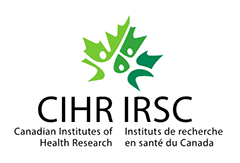
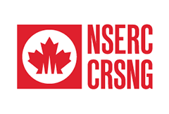
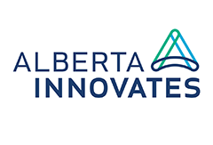
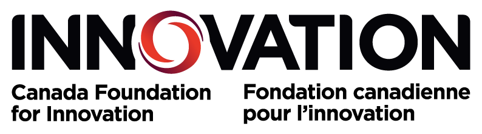
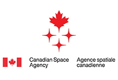
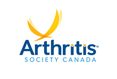
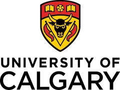
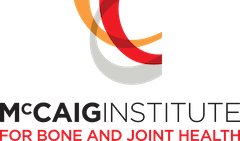

---
---
# Welcome!


  {%
    include figure.html
    image="images/general/BIL_CT_Room.jpg"
    width="100%"
  %}




At the University of Calgary, the Bone Imaging Laboratory studies how bone structure and strength change with ageing, injury and altered loading. We combine high-resolution medical imaging, computational biomechanics and machine learning to measure skeletal change and develop tools for fracture-risk assessment.

Our research spans microarchitecture-based fracture prediction, quantitative analysis of clinical CT, and bone and joint changes after knee injury. We also share analysis methods and benchmark resources so that others can test and build on our work.

Our long-term goal is to improve the assessment of bone and joint health and inform strategies that preserve mobility.





## Highlights



From bone microarchitecture to estimated strength and fracture risk, we develop and evaluate imaging-based measures of skeletal health. Our studies follow bone change in populations and after knee injury, while our computational work makes these measurements more quantitative and reproducible.









Explore microarchitecture-based fracture-risk assessment, opportunistic CT, knee-injury imaging, and bone adaptation during spaceflight—alongside the methods and shared resources that support these studies.









Our team includes undergraduate summer students, graduate students doing their MSc or PhD, post-doctoral fellows, medical imaging
and computational specialists, staff, and faculty. We collaborate with people in Calgary and around the world.











## Funding

 <!-- width="50%" link="https://cihr-irsc.gc.ca/e/193.html" %}-->



 <!-- width="50%" link="https://www.nserc-crsng.gc.ca/index_eng.asp" %}-->



 <!-- width="50%" link="https://albertainnovates.ca/about/who-we-are/teams/health-innovations-team/" %}-->



 <!-- width="50%" link="https://www.innovation.ca" %}-->



 <!-- width="50%" link="https://www.asc-csa.gc.ca/eng/" %}-->



 <!-- width="50%" link="https://arthritis.ca" %}-->

















