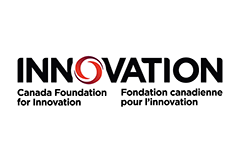
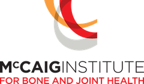

---
---
# Welcome!


  {%
    include figure.html
    image="images/general/BIL_CT_Room.jpg"
    width="100%"
  %}




The Bone Imaging Laboratory was established in 2004 at the University of Calgary by Dr. Steven Boyd, PhD, PEng. 
It is focused on using advanced imaging and computational methods for understanding the role of bone in joint injuries and disease.
Our goal is to prevent, diagnose and develop interventions to maximize bone health across the lifespan.

We collect novel image data that often involves multiple imaging modalities and develop novel computational approaches to analyse those data.
We publish our findings related to osteoporosis, osteoarthritis, high performance athletes, the effects of vitamin D, how bones are altered 
by space flight, and more.







## Highlights



Our research uses advanced medical imaging and computational methods to study bone fragility and treatments in osteoporosis 
and how to prevent osteoarthritis after suffering a joint injury.









Our research includes developing methods for fragility fracture risk, how bones change in astronauts, the effects of 
vitamin D, what happens to a knee joint after a tear of the ACL, using machine learning for assessing bone quality in
opportunistic CT, and much more.









Our team includes undergraduate summer students, graduate students doing their MSc or PhD, post-doctoral fellows, medical imaging
and computational specialists, staff, and faculty. We collaborate with people in Calgary and around the world.











## Funding

 <!-- width="50%" link="https://cihr-irsc.gc.ca/e/193.html" %}-->



 <!-- width="50%" link="https://www.nserc-crsng.gc.ca/index_eng.asp" %}-->



 <!-- width="50%" link="https://albertainnovates.ca/about/who-we-are/teams/health-innovations-team/" %}-->



 <!-- width="50%" link="https://www.innovation.ca" %}-->



 <!-- width="50%" link="https://www.asc-csa.gc.ca/eng/" %}-->



 <!-- width="50%" link="https://arthritis.ca" %}-->

















